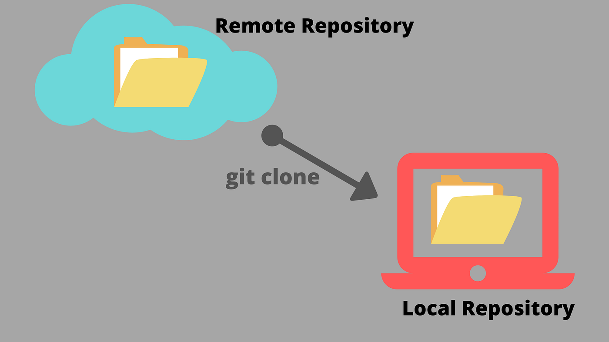

# Comandos Básicos

- En la clase de hoy vamos a ejecutar diferentes comandos de git

## Git Clone

El comando `git clone` se utiliza para crear una copia local de un repositorio que se encuentra en un servidor remoto (como GitHub o GitLab).

A diferencia de una descarga común, este comando descarga **todo el historial de versiones** y configura la conexión con el servidor de origen.



### Línea de comando

Para clonar un repositorio en tu computadora, ejecuta:

```bash
git clone [https://github.com/usuario/nombre-del-proyecto.git](https://github.com/usuario/nombre-del-proyecto.git)

```
# Ejercicio
- haz lo anterior con lo siguiente (colocando una captura de pantalla en cada comando):

- git init -> Inicializa el repositorio de Git
- git add . -> Add = agrega cambios a la fase de staging  { . } = selecciona todos los archivos
- git commit -> sube todos los cambios a una version git
- git branch gh-pages -> inicializa la rama 'gh-page'
- git checkout gh-pages -> cambia la rama en la que estas a 'gh-pages'
- git remote add origin https://github.com.... -> Establece el directorio al cual se van a publicar los cambios
- git push origin -> Sube los cambios hacia ese directorio que se establece
